```mermaid
graph TB
    User["👤 User Browser"]
    Docker["🐳 Docker Container<br/>Port: 5000"]
    App["📦 Flask Application<br/>app.py"]
    
    User -->|HTTP Requests| Docker
    Docker -.->|Contains| App
    
    subgraph "Application Components"
        App --> UI["🖥️ Web UI Templates"]
        App --> API["🔌 REST API"]
        App --> Logic["⚙️ Business Logic"]
        App --> Storage["💾 In-Memory Storage<br/>tasks array"]
    end
    
    style Docker fill:#3498db,stroke:#2980b9,stroke-width:3px,color:#fff
    style App fill:#2c3e50,stroke:#1a252f,stroke-width:2px,color:#fff
    style UI fill:#95a5a6,stroke:#7f8c8d,color:#fff
    style API fill:#95a5a6,stroke:#7f8c8d,color:#fff
    style Logic fill:#95a5a6,stroke:#7f8c8d,color:#fff
    style Storage fill:#e74c3c,stroke:#c0392b,color:#fff
```

# Flask Task Manager - Architecture Documentation

This document outlines the evolution of the Flask Task Manager from a monolithic application to a microservices architecture deployed on Kubernetes.

## BEFORE: Monolithic Architecture

### Architecture Diagram

### Characteristics

| Aspect | Details |
|--------|---------|
| **Deployment** | Single Docker container |
| **Components** | All-in-one Flask application |
| **Storage** | In-memory (non-persistent) |
| **Scalability** | Limited - single instance |
| **Availability** | Single point of failure |
| **Data Persistence** | ❌ Data lost on restart |

### Limitations

- **Data Loss**: All tasks are stored in memory and lost when the container restarts
- **No Scalability**: Cannot run multiple instances due to in-memory storage
- **Single Point of Failure**: If the container crashes, the entire application is down
- **Tight Coupling**: UI, API, and business logic are all in one file
- **Limited Resources**: One container shares CPU/memory for all operations

---

## AFTER: Microservices on Kubernetes

### Architecture Diagram

```mermaid
graph TB
    User["👤 User Browser"]
    
    subgraph K8s["☸️ Kubernetes Cluster - Namespace: task-manager"]
        subgraph Frontend[Frontend Layer]
            FrontSvc["🌐 Frontend Service<br/>NodePort: 30080"]
            FrontPod1[Frontend Pod 1]
            FrontPod2[Frontend Pod 2]
            
            FrontSvc --> FrontPod1
            FrontSvc --> FrontPod2
        end
        
        subgraph Backend[Backend Layer]
            BackSvc["🔌 Backend API Service<br/>ClusterIP: 5000"]
            BackPod1[Backend Pod 1]
            BackPod2[Backend Pod 2]
            
            BackSvc --> BackPod1
            BackSvc --> BackPod2
        end
        
        subgraph Database[Database Layer]
            DBSvc["🗄️ PostgreSQL Service<br/>ClusterIP: 5432"]
            DBPod[PostgreSQL Pod]
            PV["💾 PersistentVolume<br/>1Gi Storage"]
            
            DBSvc --> DBPod
            DBPod --> PV
        end
        
        ConfigMap["📋 ConfigMap<br/>App Configuration"]
        Secret["🔐 Secret<br/>DB Credentials"]
    end
    
    User -->|HTTP| FrontSvc
    FrontPod1 & FrontPod2 -->|REST API| BackSvc
    BackPod1 & BackPod2 -->|SQL| DBSvc
    
    BackPod1 & BackPod2 -.->|Reads| ConfigMap
    BackPod1 & BackPod2 -.->|Reads| Secret
    
    style K8s fill:#326ce5,stroke:#1a4b9e,stroke-width:4px,color:#fff
    style FrontSvc fill:#27ae60,stroke:#1e8449,stroke-width:2px,color:#fff
    style BackSvc fill:#f39c12,stroke:#d68910,stroke-width:2px,color:#fff
    style DBSvc fill:#8e44ad,stroke:#6c3483,stroke-width:2px,color:#fff
    style FrontPod1 fill:#2ecc71,stroke:#27ae60,color:#fff
    style FrontPod2 fill:#2ecc71,stroke:#27ae60,color:#fff
    style BackPod1 fill:#f1c40f,stroke:#f39c12,color:#000
    style BackPod2 fill:#f1c40f,stroke:#f39c12,color:#000
    style DBPod fill:#9b59b6,stroke:#8e44ad,color:#fff
    style PV fill:#34495e,stroke:#2c3e50,stroke-width:2px,color:#fff
    style ConfigMap fill:#3498db,stroke:#2980b9,color:#fff
    style Secret fill:#e74c3c,stroke:#c0392b,color:#fff
```

### Service Communication Flow

```mermaid
sequenceDiagram
    participant User as 👤 User Browser
    participant FS as Frontend Service
    participant FP as Frontend Pod
    participant BS as Backend Service
    participant BP as Backend Pod
    participant DS as DB Service
    participant DB as PostgreSQL Pod
    participant PV as PersistentVolume
    
    User->>FS: HTTP Request (GET /)
    FS->>FP: Route to available pod
    FP->>BS: API Call (GET /api/tasks)
    BS->>BP: Route to available pod
    BP->>DS: Database query
    DS->>DB: Route to DB pod
    DB->>PV: Read data
    PV-->>DB: Return data
    DB-->>BP: Query results
    BP-->>FP: JSON response
    FP-->>User: Rendered HTML
```

### Characteristics

| Aspect | Details |
|--------|---------|
| **Deployment** | 3 microservices across 5 pods |
| **Components** | Frontend, Backend API, PostgreSQL |
| **Storage** | Persistent volume (PostgreSQL) |
| **Scalability** | ✅ Horizontal scaling (2 replicas each) |
| **Availability** | ✅ High availability with multiple replicas |
| **Data Persistence** | ✅ Data survives pod restarts |

### Microservices Breakdown

#### 1. Frontend Service

**Purpose**: Serve web UI and static assets

| Property | Value |
|----------|-------|
| **Language** | Python (Flask) |
| **Replicas** | 2 |
| **Port** | 8080 |
| **Service Type** | NodePort (external access) |
| **Dependencies** | Backend API Service |

**Responsibilities**:
- Render HTML templates
- Serve CSS, JavaScript, images
- Proxy API calls to backend
- Handle user sessions

#### 2. Backend API Service

**Purpose**: Core business logic and data management

| Property | Value |
|----------|-------|
| **Language** | Python (Flask + SQLAlchemy) |
| **Replicas** | 2 |
| **Port** | 5000 |
| **Service Type** | ClusterIP (internal only) |
| **Dependencies** | PostgreSQL Service |

**Responsibilities**:
- CRUD operations for tasks
- REST API endpoints
- Database ORM operations
- Business logic validation
- Health check endpoint

#### 3. PostgreSQL Service

**Purpose**: Persistent data storage

| Property | Value |
|----------|-------|
| **Image** | postgres:15-alpine |
| **Replicas** | 1 (StatefulSet recommended for production) |
| **Port** | 5432 |
| **Service Type** | ClusterIP (internal only) |
| **Storage** | 1Gi PersistentVolume |

**Responsibilities**:
- Store tasks data
- Handle queries from backend
- Data persistence and integrity
- Transaction management

### Kubernetes Resources

#### Namespace
- **Name**: `task-manager`
- **Purpose**: Isolate application resources

#### ConfigMap
- **Name**: `app-config`
- **Contents**:
  - Database name
  - Backend API URL
  - Application settings

#### Secret
- **Name**: `db-credentials`
- **Contents** (base64 encoded):
  - PostgreSQL password
  - Database username

#### Services

| Service | Type | Port | Target Port | Purpose |
|---------|------|------|-------------|---------|
| `frontend` | NodePort | 30080 | 8080 | External access to UI |
| `backend-api` | ClusterIP | 5000 | 5000 | Internal API access |
| `postgres` | ClusterIP | 5432 | 5432 | Internal DB access |

#### Deployments

| Deployment | Replicas | Image | Resource Limits |
|------------|----------|-------|-----------------|
| `frontend` | 2 | flask-task-manager-frontend:latest | 256Mi RAM, 0.5 CPU |
| `backend-api` | 2 | flask-task-manager-backend:latest | 512Mi RAM, 0.5 CPU |
| `postgres` | 1 | postgres:15-alpine | 512Mi RAM, 0.5 CPU |

### Benefits of Microservices Architecture

#### ✅ Scalability
- Frontend and backend can scale independently
- Add more replicas during high load
- Kubernetes automatically load balances traffic

#### ✅ High Availability
- Multiple replicas ensure zero downtime
- If one pod fails, traffic routes to healthy pods
- Self-healing: Kubernetes restarts failed pods

#### ✅ Data Persistence
- PostgreSQL with PersistentVolume
- Data survives pod restarts and crashes
- Database backups possible

#### ✅ Separation of Concerns
- Frontend focuses on UI rendering
- Backend focuses on business logic
- Database focuses on data storage

#### ✅ Independent Development
- Teams can work on services independently
- Different release cycles for each service
- Technology stack flexibility

#### ✅ Resilience
- Failure in one service doesn't crash entire app
- Circuit breakers can be added
- Graceful degradation possible

### Deployment Architecture

```mermaid
graph LR
    subgraph Dev[Developer Workstation]
        Code[💻 Source Code]
        Docker[🐳 Docker Build]
    end
    
    subgraph Registry[Container Registry]
        Images[📦 Docker Images]
    end
    
    subgraph K8s[☸️ Kind Cluster]
        Manifests[📄 K8s Manifests]
        Cluster[Kubernetes Resources]
    end
    
    Code -->|docker build| Docker
    Docker -->|docker push| Images
    Images -->|kind load| Cluster
    Manifests -->|kubectl apply| Cluster
    
    style Dev fill:#3498db,stroke:#2980b9,stroke-width:2px,color:#fff
    style Registry fill:#27ae60,stroke:#1e8449,stroke-width:2px,color:#fff
    style K8s fill:#326ce5,stroke:#1a4b9e,stroke-width:2px,color:#fff
```

### Resource Topology

## Comparison Summary

| Feature | Before (Monolith) | After (Microservices) |
|---------|-------------------|----------------------|
| **Architecture** | Single container | 5 pods across 3 services |
| **Storage** | In-memory | PostgreSQL + PersistentVolume |
| **Data Persistence** | ❌ Lost on restart | ✅ Persistent |
| **Scalability** | ❌ Single instance | ✅ Horizontal scaling |
| **High Availability** | ❌ Single point of failure | ✅ Multiple replicas |
| **Resource Isolation** | ❌ Shared resources | ✅ Independent resources |
| **Independent Deployment** | ❌ Monolith | ✅ Service-level deploys |
| **Complexity** | Low | Medium |
| **Operational Overhead** | Low | Medium-High |
| **Production Ready** | No | Yes |

## Next Steps

1. **Implementation**: Build the microservices and Docker images
2. **Kubernetes Setup**: Create kind cluster and apply manifests
3. **Testing**: Verify all services communicate correctly
4. **Monitoring**: Add observability (Prometheus, Grafana)
5. **CI/CD**: Automate builds and deployments
6. **Security**: Add RBAC, Network Policies, Pod Security Policies

---

**Document Version**: 1.0  
**Last Updated**: 2025-11-29  
**Author**: Antigravity AI
